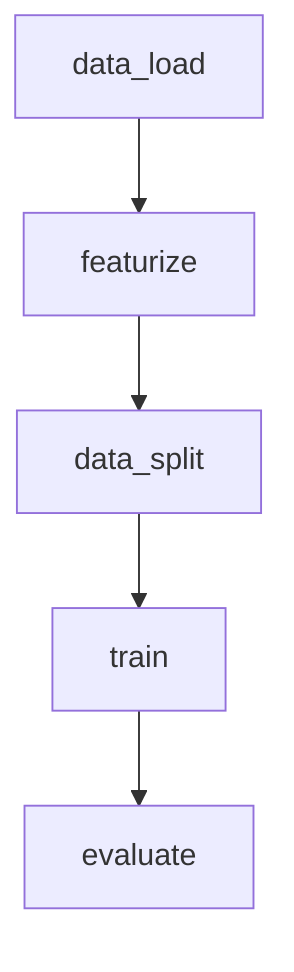

# course-ds-base



## Preparation

### 1. Fork / Clone this repository

```bash
git clone https://github.com/iterative/course-ds-base.git
cd course-ds-base
```


### 2. Create and activate virtual environment

Create virtual environment named `dvc-venv` (you may use other name)
```bash
python3 -m venv dvc-venv
echo "export PYTHONPATH=$PWD" >> dvc-venv/bin/activate
source dvc-venv/bin/activate
```
Install python libraries

```bash
pip install --upgrade pip setuptools wheel
pip install -r requirements.txt
```

Add Virtual Environment to Jupyter Notebook

```bash
python -m ipykernel install --user --name=dvc-venv
``` 

Configure ToC for jupyter notebook (optional)

```bash
jupyter contrib nbextension install --user
jupyter nbextension enable toc2/main
```

## 3. Run Jupyter Notebook

```bash
jupyter notebook
```

